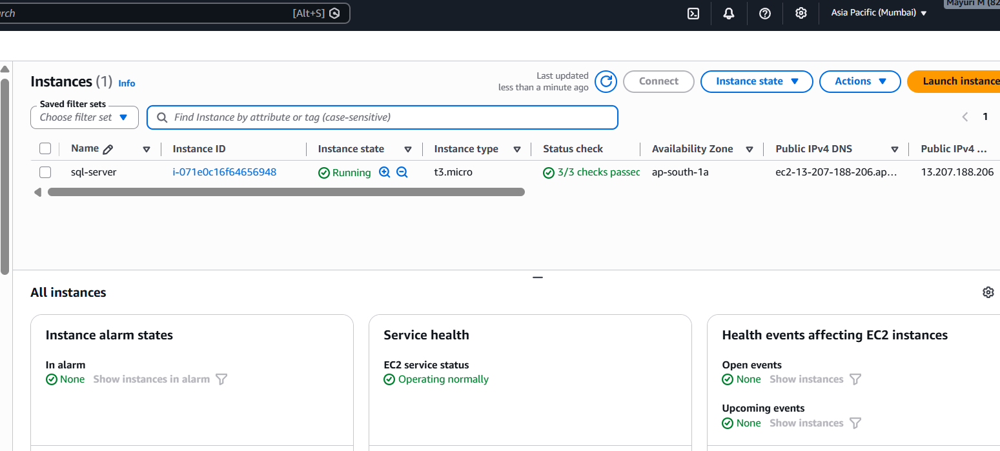
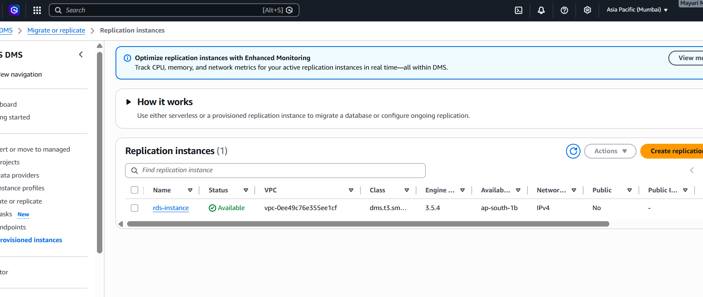
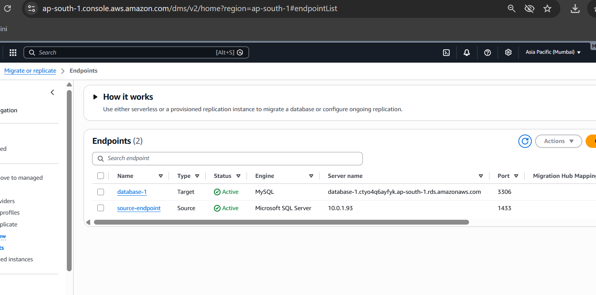
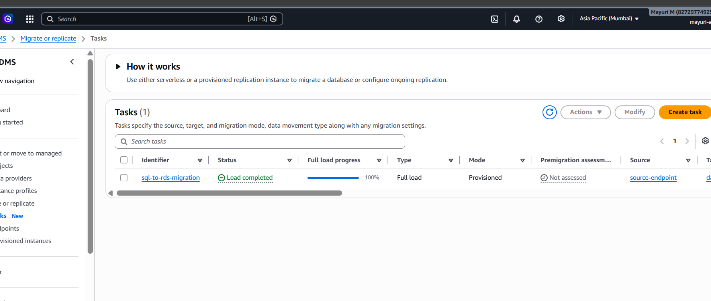
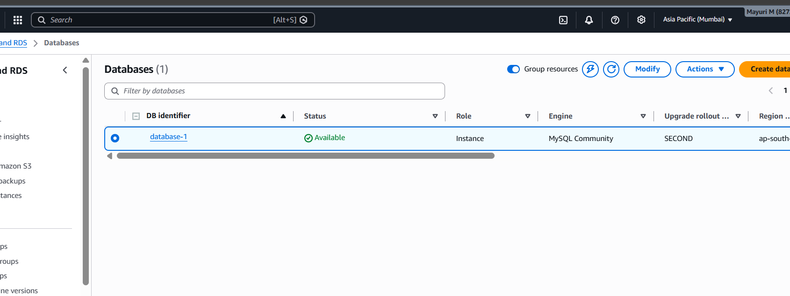
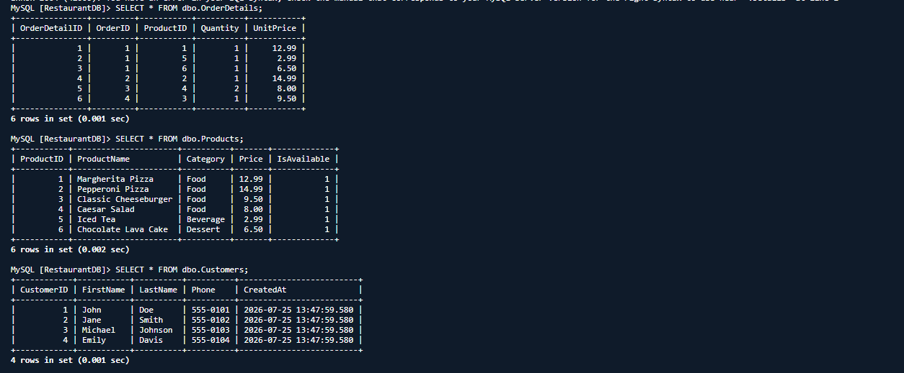
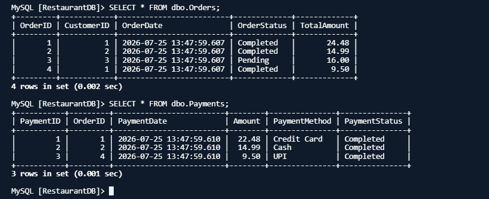
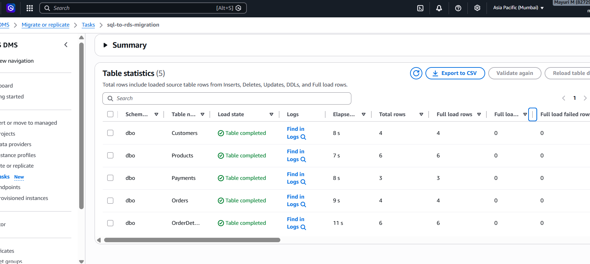

# SQL Server to Amazon RDS MySQL Migration using AWS DMS

## 📌 Project Overview

This project implements a heterogeneous database migration from **Microsoft SQL Server Express** hosted on a **Windows Server running on Amazon EC2** to **Amazon RDS for MySQL** using **AWS Database Migration Service (AWS DMS)**.

The project represents a database modernization scenario in which a self-managed SQL Server database is migrated to a managed AWS database service.

The migration was successfully completed with:

- **23 total rows migrated**
- **0 migration errors**
- Migrated data successfully validated in the target Amazon RDS MySQL database
- Target database and table contents verified using AWS CloudShell

---

## 🎯 Project Objective

The objective of this project was to design and implement a structured database migration workflow using **AWS Database Migration Service (AWS DMS)**, migrating a restaurant database from **Microsoft SQL Server** to **Amazon RDS for MySQL**.

The implementation focused on:

- Establishing a SQL Server source environment on Amazon EC2
- Configuring SQL Server Express and SQL Server Management Studio (SSMS)
- Creating and populating a relational restaurant database
- Configuring AWS DMS source and target endpoints
- Establishing connectivity between the source SQL Server and target Amazon RDS MySQL database
- Executing a full-load database migration
- Monitoring the migration process
- Validating migrated data in the target database
- Connecting to Amazon RDS using AWS CloudShell
- Verifying migrated table contents after migration
- Troubleshooting database connectivity and endpoint configuration issues

---

## 🛠️ Technologies and AWS Services

### AWS Services

- Amazon EC2
- Amazon RDS for MySQL
- AWS Database Migration Service (AWS DMS)
- Amazon VPC
- Security Groups
- AWS CloudShell

### Database Technologies

- Microsoft SQL Server Express
- MySQL
- SQL Server Management Studio (SSMS)

### Other Technologies

- Windows Server
- SQL
- GitHub

---

## 🗄️ Source Database

The source database was created using **SQL Server Express** running on a Windows Server hosted on Amazon EC2.

The database represents a simplified restaurant ordering system.

### Source Database

RestaurantDB

- Customers
- Orders
- OrderDetail
- Payments
- Products

The database contains structured relational data related to:

- Customers
- Restaurant Orders
- Order Details
- Payments
- Products

---

## 📊 Database Tables

### 1. Customers

Stores information about restaurant customers.

Example fields:

CustomerID  
CustomerName  
Email  
Phone

### 2. Orders

Stores information about customer orders.

Example fields:

OrderID  
CustomerID  
OrderDate  
OrderStatus

### 3. OrderDetail

Stores individual products included in each order.

Example fields:

OrderDetailID  
OrderID  
ProductID  
Quantity  
UnitPrice

### 4. Payments

Stores payment information associated with orders.

Example fields:

PaymentID  
OrderID  
PaymentDate  
Amount  
PaymentStatus

### 5. Products

Stores restaurant menu and product information.

Example fields:

ProductID  
ProductName  
Category  
Price

The database represents a relational restaurant data model where customers place orders, orders contain products, and payment information is associated with orders.

---

## ☁️ Target Database

The target database was created using **Amazon RDS for MySQL**.

Amazon RDS was selected as the target platform to provide a managed relational database environment and reduce the operational overhead associated with managing the underlying database infrastructure.

### Target Database Configuration

Database Engine: MySQL  
Port: 3306

---

## 🔄 AWS Database Migration Service

**AWS Database Migration Service (AWS DMS)** was used to migrate the restaurant database from SQL Server to Amazon RDS for MySQL.

The migration process consisted of:

1. Creating the SQL Server source database on Amazon EC2
2. Creating the Amazon RDS MySQL target database
3. Creating the AWS DMS replication instance
4. Creating the SQL Server source endpoint
5. Creating the RDS MySQL target endpoint
6. Testing endpoint connectivity
7. Creating the DMS migration task
8. Performing a full-load migration
9. Monitoring the migration task
10. Validating the migrated data
11. Connecting to Amazon RDS using AWS CloudShell
12. Verifying migrated table contents

---

## 🔌 Endpoint Configuration

### Source Endpoint

The source endpoint represented the SQL Server Express database running on Amazon EC2.

Database Engine: Microsoft SQL Server  
Port: 1433  
Source: SQL Server Express on Amazon EC2  
Database: RestaurantDB

SQL Server was configured to use TCP port `1433` for database connectivity.

### Target Endpoint

The target endpoint represented the Amazon RDS MySQL database.

Database Engine: MySQL  
Port: 3306  
Target: Amazon RDS for MySQL

The target endpoint was successfully tested before performing the migration.

---

## 🚀 Migration Task

The AWS DMS migration task was configured to perform a **Full Load** migration.

The existing data in the SQL Server source database was transferred to the Amazon RDS MySQL target database.

### Migration Type

Full Load

---
###Amazon EC2 Instance



Screenshot showing the Windows Server EC2 instance used to host the SQL Server source database.

###SQL Server Express Database and Data


Screenshot showing SQL Server Express running inside the EC2 Windows Server environment with the RestaurantDB database, tables, and source data.

### Amazon RDS Instance



Screenshot showing the Amazon RDS MySQL instance created as the target database.

### DMS Source Endpoint and DMS Target Endpoint



Screenshot showing the configured SQL Server source endpoint and Amazon RDS MySQL target endpoint.

Source:

SQL Server Express  
Running on EC2  
Port: 1433

Target:

Amazon RDS MySQL  
Port: 3306

###AWS DMS task



Screenshot showing the AWS DMS task used for the database migration.


### Database Created in Amazon RDS



Screenshot showing the target database prepared for the AWS DMS migration.

### Migrated Data Verification




Screenshot showing the migrated table contents queried from Amazon RDS MySQL using AWS CloudShell.
This serves as evidence that the data was successfully migrated from SQL Server to Amazon RDS MySQL.

### Table Statistics from DMS 



Screenshot showing that successful table creation from DMS 


---

## ✅ Migration Result

The migration was completed successfully.

### Migration Summary

Total Rows Migrated: 23  
Migration Errors: 0  
Migration Status: Successful

The migrated data was verified in the Amazon RDS MySQL target database.

The source and target data were compared to confirm that the migrated records were correct.

### Final Result

SQL Server Source
        |
        | AWS DMS Full Load
        v
Amazon RDS MySQL
        |
        v
23 Rows Successfully Migrated
        |
        v
0 Errors
        |
        v
Data Validated Successfully
        |
        v
Verified using AWS CloudShell

---

## 🔍 Data Validation

After completing the migration, the target database was validated.

The following validation activities were performed:

- Verified that the target Amazon RDS database was successfully created
- Verified that the target database was available
- Verified that migrated tables were present
- Verified that migrated records were available
- Compared source and target data
- Confirmed that the migrated records were correct
- Verified that AWS DMS reported zero migration errors
- Connected to Amazon RDS MySQL using AWS CloudShell
- Queried the migrated tables from AWS CloudShell
- Confirmed the migrated table contents

The AWS CloudShell verification provided additional confirmation that the data migrated by AWS DMS was successfully available in the target Amazon RDS MySQL database.

---

## 🖥️ AWS CloudShell Validation

AWS CloudShell was used to connect to the Amazon RDS MySQL database after completing the migration.

The connection was used to verify the migrated data directly from the AWS environment.

The validation process confirmed that:

- AWS CloudShell successfully connected to the RDS MySQL database
- The migrated database was accessible
- Migrated tables were available
- Migrated records were present
- The table contents matched the expected migrated data

This validation confirmed that the data migrated through AWS DMS was available in the target Amazon RDS MySQL database.

---

## 🔐 Networking and Security

The project involved AWS networking and database connectivity concepts.

The following components and concepts were used:

- Amazon VPC
- Security Groups
- Private networking
- SQL Server TCP connectivity
- SQL Server port `1433`
- MySQL port `3306`
- DMS source endpoint connectivity
- DMS target endpoint connectivity

Security Groups were used to control network access between the AWS resources.

Database connectivity was configured to allow the required communication between the source, migration infrastructure, and target database.

---

## 🧩 Challenges and Troubleshooting

During the initial implementation, the original architecture was planned to migrate a SQL Server database running on a local laptop to Amazon RDS MySQL using AWS DMS.

However, the local SQL Server was running behind a private local network, and the AWS DMS replication instance could not directly establish a connection to the local SQL Server.

The DMS source endpoint test resulted in connectivity and timeout errors.

The issue was identified as a network connectivity limitation between the local SQL Server environment and the AWS DMS replication instance.

To resolve the connectivity limitation, the source database environment was moved into AWS by deploying SQL Server Express on a Windows Server running on Amazon EC2.

The SQL Server database and restaurant data were recreated on the EC2-hosted SQL Server environment.

After configuring the source endpoint and required connectivity, the DMS migration was successfully completed.

This troubleshooting process involved:

- Database connectivity troubleshooting
- TCP port configuration
- SQL Server configuration
- Security Group configuration
- DMS endpoint configuration
- AWS networking
- Migration validation

---

## 💡 Real-World Use Case

This project represents a simplified database modernization and migration scenario.

Organizations may have self-managed SQL Server databases running on Windows-based infrastructure and may choose to migrate their database workloads to managed AWS database services.

A typical migration workflow involves moving data from an existing database environment to a managed database platform while maintaining data integrity and validating the migrated data.

The objective is to migrate the database workload to a managed AWS platform while reducing the operational overhead associated with managing database infrastructure.

For larger production migrations, additional activities may be required, including:

- Schema assessment
- Schema conversion
- Application compatibility testing
- Change Data Capture (CDC)
- Performance testing
- Security hardening
- Monitoring and alerting
- Backup and recovery planning
- Production cutover planning

## 📚 Key Technical Areas

### AWS Infrastructure

- Amazon EC2
- Amazon RDS
- Amazon VPC
- Security Groups
- AWS CloudShell

### Database Administration

- SQL Server Express
- SQL Server Management Studio
- MySQL
- Relational database design
- Database tables and relationships

### Database Migration

- AWS Database Migration Service
- DMS source endpoints
- DMS target endpoints
- DMS replication instances
- Full-load migration
- Data validation

### Troubleshooting

- SQL Server connectivity
- TCP port configuration
- DMS endpoint connectivity
- AWS networking
- Security Group configuration
- Source and target database validation

---

## 🎯 Final Outcome

Successfully implemented a heterogeneous database migration from **Microsoft SQL Server Express hosted on Amazon EC2** to **Amazon RDS for MySQL** using **AWS Database Migration Service (AWS DMS)**.

The project successfully demonstrated:

- EC2-based SQL Server source environment
- SQL Server Express configuration
- SQL Server Management Studio usage
- Restaurant database creation
- AWS DMS source and target endpoint configuration
- Full-load database migration
- Successful migration of 23 rows
- Zero migration errors
- Target database validation
- AWS CloudShell connectivity to RDS
- Verification of migrated table contents
- Troubleshooting of database connectivity issues

---

## 📌 Project Summary

```text
SOURCE
Amazon EC2
|
├── Windows Server
├── SQL Server Express
└── RestaurantDB
       |
       | Port 1433
       v
AWS DMS
|
├── Source Endpoint
├── Replication Instance
├── Migration Task
└── Target Endpoint
       |
       | Port 3306
       v
TARGET
Amazon RDS MySQL
|
└── Migrated Restaurant Data
        |
        v
AWS CloudShell
        |
        v
Table Content Verified
        |
        v
23 Rows | 0 Errors | Validated

👩‍💻 Author

Mayuri M

AWS Data Migration Project

Technologies

AWS EC2 RDS DMS VPC Security-Groups CloudShell SQL-Server MySQL-SSMS

